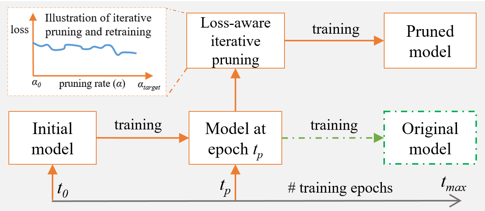
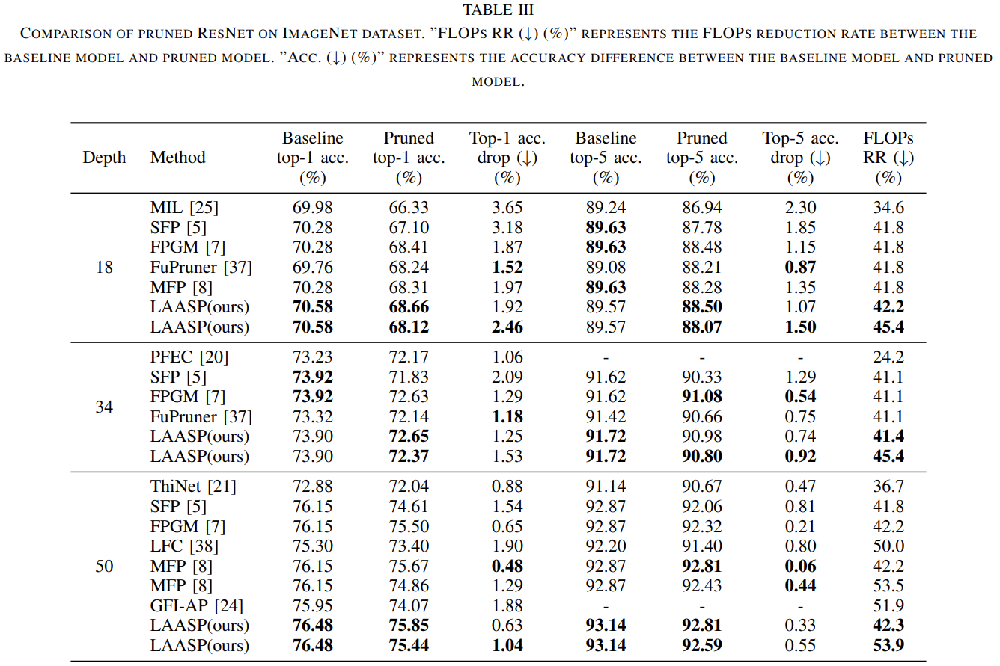

# LAASP: Loss-Aware Automatic Selection of Filter Pruning Criteria for Deep Neural Network Acceleration 

Implementation of LAASP with PyTorch. Pruning the selected set of filters & restructuring the network is based on [VainF/Torch-Pruning](https://github.com/VainF/Torch-Pruning).



## Table of Contents

- [Requirements](#requirements)
- [Models](#models)
- [VGGNet on CIFAR-10](#vggnet-on-cifar-10)
  - [Training-Pruning](#training-pruning)
  - [Evaluation](#evaluation)
- [ResNet on CIFAR-10](#resnet-on-cifar-10)
  - [Training-Pruning](#training-pruning-1)
  - [Evaluation](#evaluation-1)
- [ResNet on ImageNet](#resnet-on-imagenet)
  - [Prepare ImageNet dataset](#prepare-imagenet-dataset)
  - [Training-Pruning](#training-pruning-2)
  - [Evaluation](#evaluation-2)
  - [Results](#results)

## Requirements
- Python 3.9.7
- PyTorch 1.10.2
- TorchVision 0.11.2
- matplotlib 3.5.1
- scipy 1.8.0

`Note: These are the verified version of the tools used in the experiment. You can test with other versions as well.` 

## Models

The baseline models are uploaded in [models_baseline](./models_baseline/) and pruned models are uploaded in [models_pruned](./models_pruned/) directory. Please move to the respective directories and download models from provided google drive link for evaluation and testing.

## VGGNet on CIFAR-10

The CIFAR-10 dataset will be downloaded automatically when you run the script either for pruning or evaluation. The [main_vgg_cifar10.py](./main_vgg_cifar10.py) script can be used for pruning, training, and evaluation of VggNet in the CIFAR-10 dataset. 

### Training-Pruning

```ruby
> sh scripts/vgg16_cifar10/run_vg16_pruning.sh
```

### Evaluation

- TODO

## ResNet on CIFAR-10

The CIFAR-10 dataset will be downloaded automatically when you run the script either for pruning or evaluation. The [main_resnet_cifar10.py](./main_resnet_cifar10.py) script can be used for pruning, training, and evaluation of VggNet in the CIFAR-10 dataset.

### Training-Pruning

```ruby
> sh scripts/resnet_cifar10/run_resnet_cifar10_pruning.sh 
```

### Evaluation

```ruby
> sh scripts/resnet_cifar10/run_resnet_cifar10_eval.sh 
```

## ResNet on ImageNet

The [main_resnet_imagenet.py](./main_resnet_imagenet.py) file can be used for pruning, training, and evaluation of ResNet models in the ImageNet dataset. 

### Prepare ImageNet dataset

- Download the images from http://image-net.org/download-images

- Extract the training data:

  ```ruby
  mkdir train && mv ILSVRC2012_img_train.tar train/ && cd train
  tar -xvf ILSVRC2012_img_train.tar && rm -f ILSVRC2012_img_train.tar
  find . -name "*.tar" | while read NAME ; do mkdir -p "${NAME%.tar}"; tar -xvf "${NAME}" -C "${NAME%.tar}"; rm -f "${NAME}"; done
  cd ..
  ```

- Extract the validation data and move images to subfolders:

  ```ruby
  mkdir val && mv ILSVRC2012_img_val.tar val/ && cd val && tar -xvf ILSVRC2012_img_val.tar
  wget -qO- https://raw.githubusercontent.com/soumith/imagenetloader.torch/master/valprep.sh | bash
  ```

### Training-Pruning

```ruby
> sh scripts/resnet_imagenet/run_resnet_imagenet_pruning.sh
```

### Evaluation

```ruby
> sh scripts/resnet_imagenet/run_resnet_imagenet_eval.sh
```

### Results

